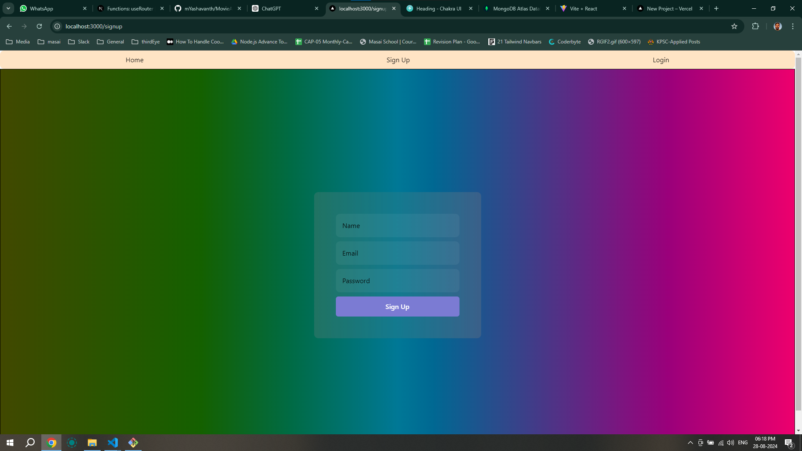
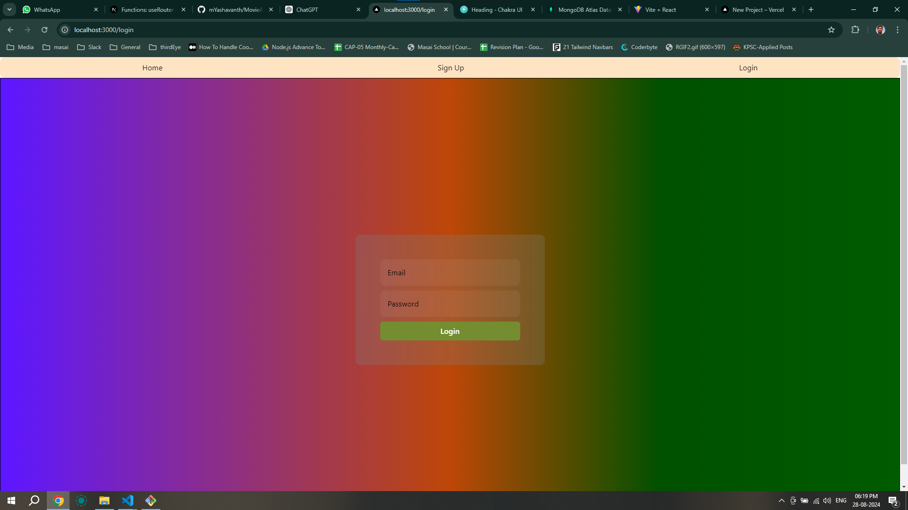
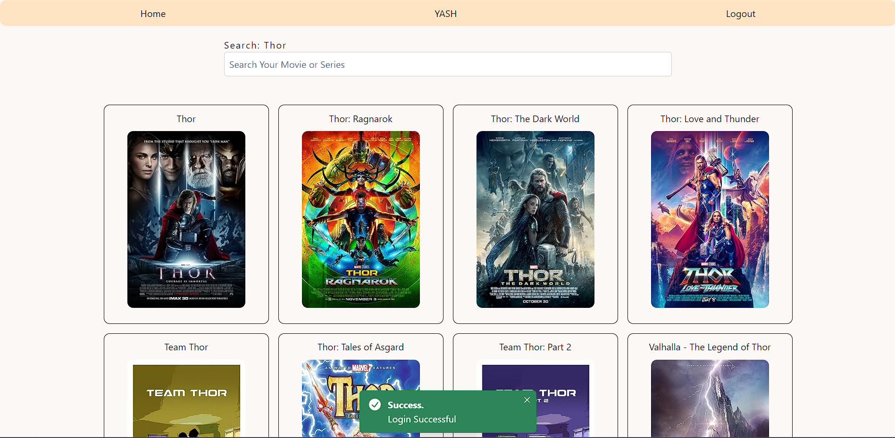
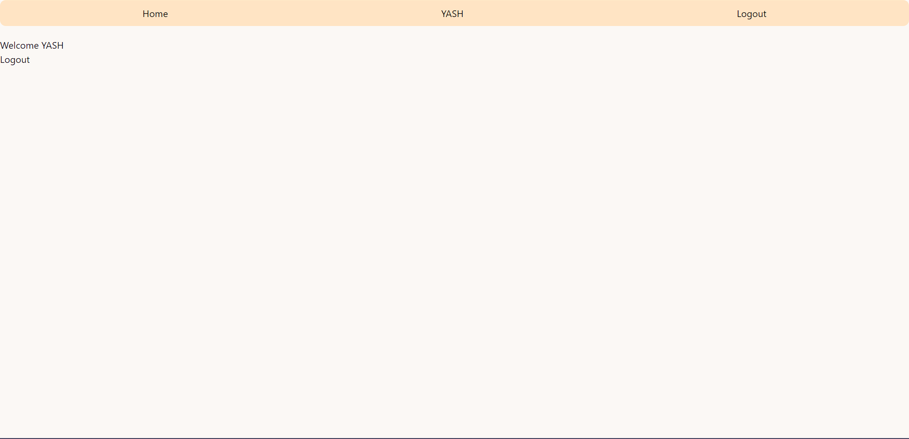
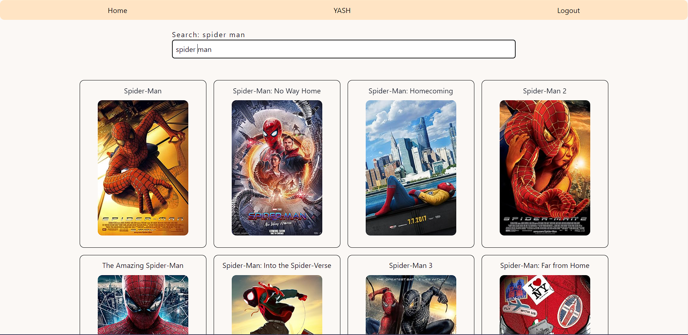
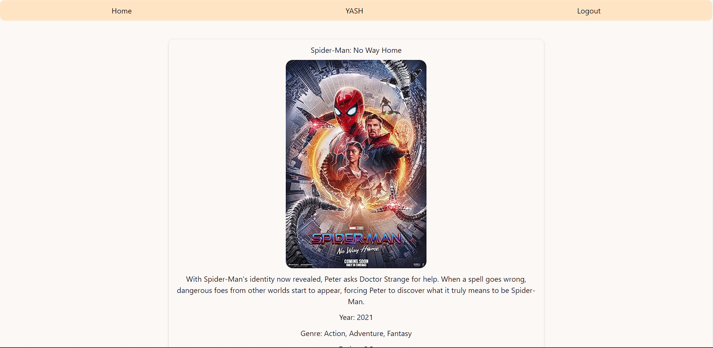

# Movie Details App

A web application for exploring details about movies and web series.

## Table of Contents

- [Overview](#overview)
- [Features](#features)
- [Technologies Used](#technologies-used)
- [Getting Started](#getting-started)
- [Demo](#demo)
- [Screenshots](#screenshots)
- [Navbar](#navbar)
- [User Authentication](#user-authentication)
- [Search Functionality](#search-functionality)
- [Details Page](#details-page)

## Overview

The Movie Details App provides users with a platform to discover comprehensive information about movies and web series. From basic details like titles and release dates to in-depth information about cast, crew, and plot summaries, this app aims to be a one-stop destination for cinephiles.

## Features

- Search and explore a vast database of movies and web series.
- Access detailed information about each title, including cast, crew, and plot.
- Stay updated with release dates and upcoming releases.
- User-friendly interface for an engaging and seamless experience.

## Technologies Used

- HTML
- CSS
- JavaScript
- React.js
- Next.js
- Chakra UI
- Vercel

## Getting Started

1. **Clone the repository:**

   ```bash
   git clone https://github.com/mYashavanth/next_movie_app.git

   ```

2. **Install dependencies:**

   ```bash
   npm install

   ```

3. **Run the application:**

   ```bash
   npm run dev

   ```

- This will launch the application on Localhost

## Demo

Check out the live demo of the Movie Details App here.

## Screenshots








## Navbar

The navigation bar is available on all pages and includes the following attributes:

- Home: Navigate to the home page.
- Signup: Register for a new account.
- Login: Log in to your account.
- User Details: View and manage user-specific information.
- Logout: Log out of your account.

## User Authentication

- To access the home page, users need to sign up and then log in using their credentials.
- Once logged in, the navbar will display the User Details attribute, allowing users to view and manage their account information.
- Users can log out at any time to end their session.

## Search Functionality

- Users can search for any movie or series they want using the search bar on the home page.
- The search results will be displayed, showing relevant titles and brief information.

## Details Page

- Clicking on each search result will take users to a dedicated details page for that movie or series.
- The details page will provide in-depth information about the selected title, including cast, crew, plot, and more.
